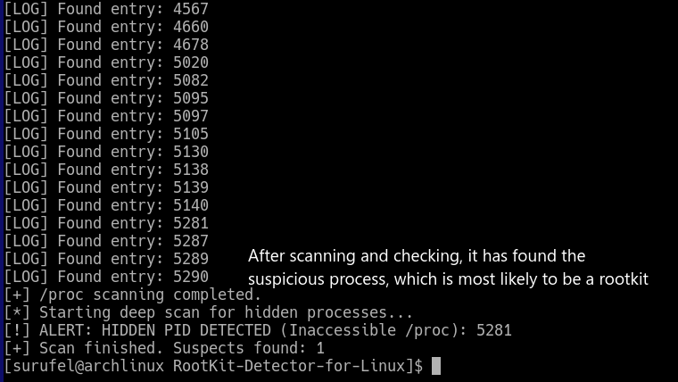

# RootKit-Detector-for-Linux

A lightweight security tool written in C to detect hidden processes using Cross-View Analysis.

Malicious software (Rootkits) often hides processes by mounting an empty filesystem (like `tmpfs`) over `/proc/PID`. This makes the process invisible to standard tools like `ps`, `top`, and `htop`.

This detector identifies inconsistencies between the Linux Kernel and the `/proc` filesystem:

Procfs Scan: It attempts to map all visible processes in `/proc`.

Kernel Verification: It uses the kill(pid, 0) syscall to check if a PID actually exists in the Kernel's table.

Cross-Check: If the Kernel confirms a PID exists but its `/proc` data is inaccessible or missing, it flags the process as HIDDEN.

## Features

Anti-Mount Masking: Detects processes hidden via mount points.

False Positive Filtering: Distinguishes between parent processes and threads (TGID check).

Lightweight: Uses a Bitset for fast PID tracking with minimal memory overhead.

## Preview & Demonstration 🔍

Below you can see the detector in action. The tool performs a cross-view analysis between the `/proc` filesystem and direct Kernel signaling.


The PID above comes from a shell script which hides the process by using Mount Masking



The detector successfully identifies the hidden PID that standard tools like `ps` or `top` would miss:

## Build Process

First, you'll have to clone the repository and change to the repository directory. You can do this by running:

```bash
git clone https://github.com/surufel/RootKit-Detector-for-Linux.git && cd RootKit-Detector-for-Linux
```

Then, you have to compile the program, run:

```bash
make
```

And let the Makefile compile it for you.

Alternatively, you may run:

```bash
gcc rootkit_detector.c -o rootkit_detector
```

## Usage

**You must run this program as root, or with sudo.**

```bash
sudo ./rootkit_detector
```

## Disclaimer ⚠️

**This tool is for educational and security auditing purposes only. Always run security tools in controlled environments.**

## License ⚖️

This project is licensed under the MIT License - see the [LICENSE](LICENSE) file for details.
